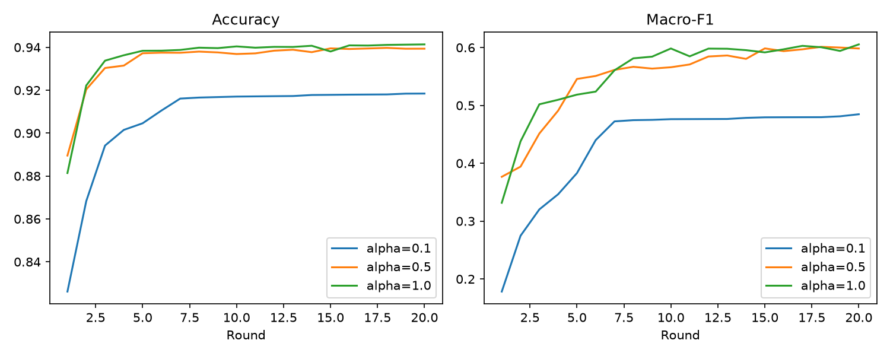

# FedAvg on Edge-IIoTset

This is my FedAvg baseline on Edge-IIoTset with non-IID clients (Dirichlet split). I measure accuracy, macro-F1 and how much data is sent per round.

## Setup
```
python -m venv venv
venv\Scripts\activate
pip install -r requirements.txt
```
I used Python 3.14 on Windows.

## Data
Download `DNN-EdgeIIoT-dataset.csv` from the Edge-IIoTset dataset on Kaggle and put it in a `data/` folder.

## Run
```
python src/preprocess.py
python src/baseline.py
python src/fedavg.py --alpha 0.5 --rounds 20 --seed 42
python src/fedavg.py --alpha 0.1 --rounds 20
python src/fedavg.py --alpha 1.0 --rounds 20
python src/fedavg.py --alpha 0.5 --rounds 20 --seed 1
python src/fedavg.py --alpha 0.5 --rounds 20 --seed 2
python src/report.py
python src/seeds.py
```
`src/explore/` has the scripts I used to look at the data first. You don't need them to reproduce the results.

## What I did
- Small MLP (46-128-64-15), 15,247 parameters
- 10 clients, all train every round, 20 rounds, 1 local epoch with SGD
- The server averages the client models, weighted by how much data each client has
- 80/20 train/test split, fixed seed
- Data sent per round: 15,247 parameters x 4 bytes x 2 (down and up) x 10 clients = 1.22 MB

## Results after 20 rounds

| Setting | Accuracy | Macro-F1 | MB per round |
|---|---|---|---|
| Centralized (Adam, 5 epochs) | 0.955 | 0.754 | - |
| FedAvg, alpha 1.0 | 0.941 | 0.606 | 1.22 |
| FedAvg, alpha 0.5 (3 seeds) | 0.940 ± 0.001 | 0.595 ± 0.005 | 1.22 |
| FedAvg, alpha 0.1 | 0.918 | 0.485 | 1.22 |



## Things to know
- 73% of the data is Normal traffic, so accuracy looks good everywhere. Macro-F1 is more useful here.
- Lower alpha means worse macro-F1. Alpha 0.5 and 1.0 are close.
- The centralized model uses Adam and FedAvg uses SGD, so they are not a fair comparison.
- Alpha 0.1 and 1.0 have only one seed.
- The communication numbers are calculated, not measured.